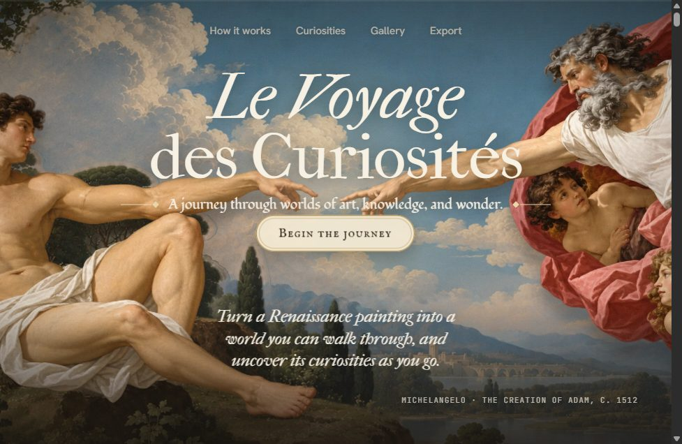
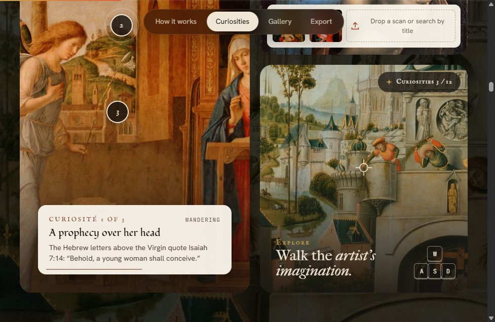
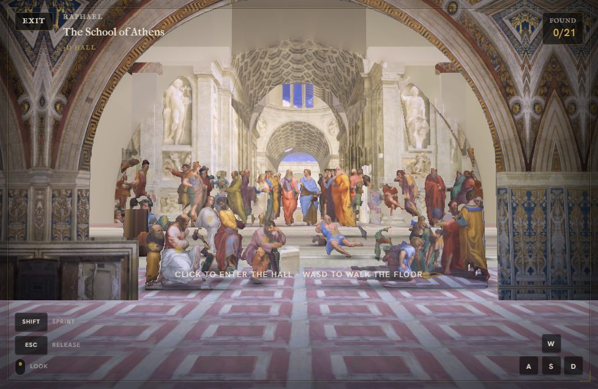
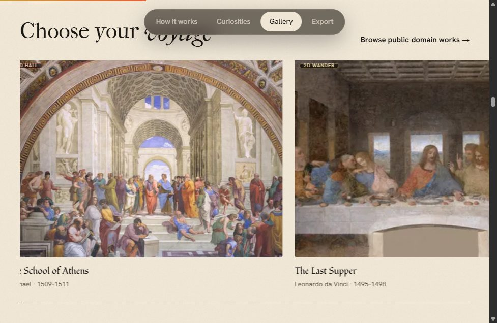
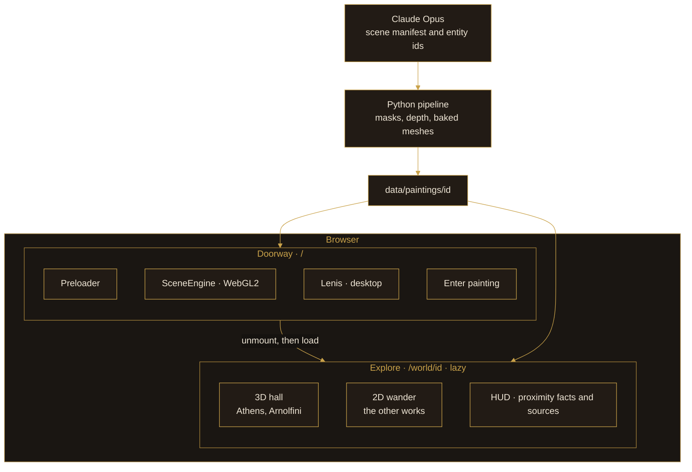
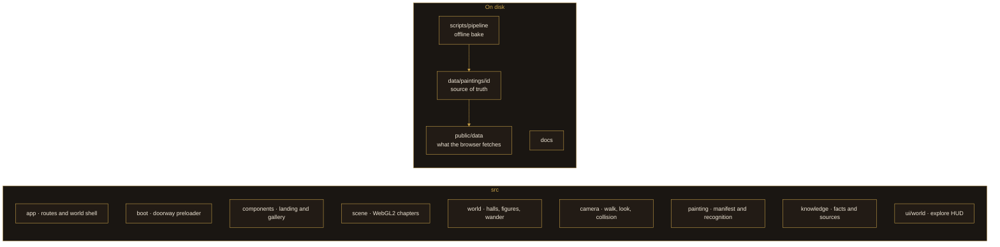
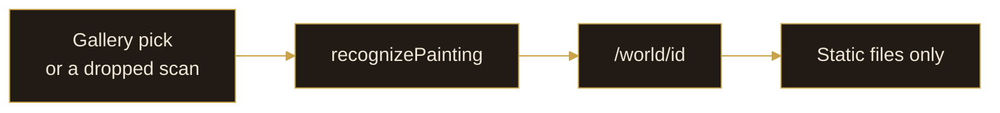

# Pérégrination

**Le Voyage des Curiosités.** Turn a Renaissance painting into a world you can walk through, and uncover its curiosities as you go.

Built during **Opus Build Day, Bangalore**.

Live: [peregrenation.vercel.app](https://peregrenation.vercel.app/)

<p>
  
</p>

The doorway is a scroll through the painting. The worlds on the other side are prepared once, offline, and then explored in the browser. Claude Opus authors the scene. The app only plays it back.

## The app

<table>
  <tr>
    <td width="50%">
      
      <br>
      <sub>Curiosities sit on the painting, with a source for each one.</sub>
    </td>
    <td width="50%">
      
      <br>
      <sub>The School of Athens as a hall you can walk. WASD, look, and 21 curiosities.</sub>
    </td>
  </tr>
</table>



<sub>Choose a voyage from the gallery, or drop a scan. A scan is matched to a prepared world. It does not build a new one.</sub>

| | |
|---|---|
| Doorway | Full-viewport landing. A construction-drawing preloader gathers a point of light between the fingers, then the hero burns in out of the same starfield used between chapters. |
| Chapters | How it works, curiosities, gallery, export. Each chapter hands off with a fire front, line art, and glitter. |
| Worlds | `/world/:paintingId`. The School of Athens and the Arnolfini Portrait are walkable 3D rooms. The other curated works open as a 2D wander. |
| Share card | Pasting the link in WhatsApp uses [`public/og.jpg`](public/og.jpg). |

## Architecture

Two WebGL stacks, and only one of them is mounted at a time. The doorway uses a custom WebGL2 engine. A world unmounts that canvas and lazy-loads React Three Fiber, so Three.js never sits in the landing bundle.



Opus decides what a world contains. Code executes that decision. Nothing calls a model per frame, per step, or when someone uploads a scan.



**Authoring**, once per painting:


**Runtime.** A scan is matched to the catalog. It never starts a new bake.



Deeper notes: [docs/ARCHITECTURE.md](docs/ARCHITECTURE.md), [docs/PROJECT.md](docs/PROJECT.md), [docs/DECISIONS.md](docs/DECISIONS.md), [docs/PIPELINE.md](docs/PIPELINE.md).

## Stack

React 19, TypeScript, Vite, React Router. Lenis for desktop scroll. A hand-written WebGL2 composite for the doorway. React Three Fiber and Three.js for the worlds. Zustand for the explore session.

On a phone the doorway drops the custom cursor, smooth-scroll, figure shadows, and the full-resolution backdrop, and holds the last frame once scrolling stops.

## Develop

```bash
npm install
npm run dev
```

```bash
npm run build
npm run preview
```

`npm run dev` mounts React twice, which releases the doorway’s WebGL context. Judge the preloader and the chapter transitions with `npm run preview` or on the live site.

Production files ship from `public/` into `dist/`. Offline bake caches, design dumps, and full-resolution frescoes stay out of git.

## Deploy

**Vercel.** Import the repo, framework Vite, build `npm run build`, output `dist`. [`vercel.json`](vercel.json) sets long-cache headers for `/assets` and `/data`, and the SPA rewrite.

**Cloudflare Pages.** Same build and output. `public/_headers` and `public/_redirects` are copied into `dist`. [`wrangler.toml`](wrangler.toml) points Pages at `dist`.
